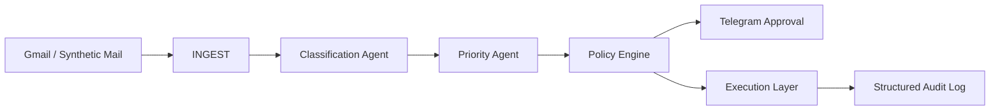

# Fedrun Mail Agent


Compact TypeScript AI mail agent for Gmail triage, local policy enforcement, Telegram human approval, and fully offline safety demos.

Fedrun Mail Agent is built as a small open-source sample of practical agent engineering: clear boundaries, conservative automation, testable safety controls, and no heavy runtime requirements.

## Architecture



## Features

- Gmail unread-message ingestion through OAuth refresh tokens.
- Local-first classification for spam, urgency, and category.
- Optional local LLM endpoint, for example Ollama, with no automatic model download.
- Independent policy engine that the model cannot bypass.
- Telegram notifications and APPROVE/REJECT approval state.
- Safe bounded auto-reply for low-risk sales and scheduling cases.
- Local JSON memory for deduplication and approval tracking.
- Atomic JSON writes, structured logs, and explicit pipeline stage results.
- Offline demo with synthetic emails and no network requirement.
- Synthetic evaluation command for deterministic behavior checks.

## Demo

```bash
npm ci
npm run demo
```

Example summary:

```text
seen: 12
processed: 11
skippedDuplicates: 1
autoRepliesPlanned: 3
autoRepliesSent: 0
approvalsRequired: 2
preventedByPolicy: 7
errors: []
```

The demo prints each email, category, risk, final action, stage trace, and suggested reply.

## Quick Start

```bash
npm ci
npm test
npm run demo
npm run evaluate
```

## Configuration

Copy `.env.example` to `.env` and set only the integrations you need.

```bash
GMAIL_CLIENT_ID=
GMAIL_CLIENT_SECRET=
GMAIL_REFRESH_TOKEN=
GMAIL_USER_EMAIL=
TELEGRAM_BOT_TOKEN=
TELEGRAM_CHAT_ID=
LOCAL_LLM_URL=
LOCAL_LLM_MODEL=
MAIL_AGENT_DRY_RUN=true
MAIL_AGENT_MAX_AUTO_REPLIES_PER_RUN=3
```

`MAIL_AGENT_DRY_RUN=true` is the default. Keep it enabled while testing real mail.

## Gmail

Gmail support is implemented in `src/gmail/client.ts`. The client can fetch unread messages and send replies when OAuth variables are configured. Without OAuth config, the live client fails closed and the offline demo remains available.

## Ollama Or Local LLM

The agent never downloads a model. If `LOCAL_LLM_URL` and `LOCAL_LLM_MODEL` are set, the shared local LLM client asks for structured JSON. If the endpoint fails or returns invalid JSON, the local classifier remains the fallback.

Example:

```bash
LOCAL_LLM_URL=http://127.0.0.1:11434/api/generate
LOCAL_LLM_MODEL=llama3.2
```

## Telegram Approval

For risky messages, Telegram receives a short summary, reason, and suggested reply with APPROVE/REJECT buttons. Callback handling is available through `handleTelegramCallback`. Only the configured `TELEGRAM_CHAT_ID` can approve or reject, and repeated callbacks are rejected.

EDIT is intentionally left out of the MVP. A safe edit flow needs persistent conversation state and reply validation.

## Safety

The policy engine in `src/policy/engine.ts` is independent of the model. The LLM can suggest fields and wording, but it cannot authorize sending, remove approval, clear prompt-injection signals, or downgrade a blocked local decision.

Automatic replies are limited to safe sales and scheduling scenarios. Financial, refund, urgent, spam, phishing, prompt-injection, unknown, and destructive requests are blocked or routed to review.

## Testing And Evaluation

```bash
npm test
npm run evaluate
```

Current synthetic evaluation:

```text
dataset: synthetic-offline-v1
evaluated: 11
skippedDuplicates: 1
categoryAccuracy: 1
actionAccuracy: 0.909
```

These results validate the deterministic synthetic demo. They do not prove accuracy on real mail.

## Documentation

- [Architecture](docs/ARCHITECTURE.md)
- [Security](docs/SECURITY.md)
- [Audit](docs/AUDIT.md)
- [Demo Guide](docs/DEMO.md)

## Limits

- Gmail OAuth setup is external.
- Telegram approval callback handling is a module, not a bundled webhook server.
- Local heuristic classification is conservative by design.
- Prompt-injection regexes are defense-in-depth, not a formal proof of safety.
- Real mail performance should be reviewed in dry-run before enabling sends.

## Roadmap

- Small webhook runner for Telegram callbacks.
- Safer EDIT flow for approval drafts.
- More labeled synthetic fixtures.
- Optional local transcript of approval decisions.
- Provider abstraction for non-Gmail mailboxes.

## Attribution

This project was inspired by [`realtuku/ai-customer-support`](https://github.com/realtuku/ai-customer-support), which is licensed under the MIT License:

> Copyright (c) 2026 Ximanta Bhuyan

No source files from that project are copied here. This repository is a fresh TypeScript implementation with separate architecture, policy enforcement, tests, and documentation.

## License

MIT © 2026 Mikhail Fedrunov
