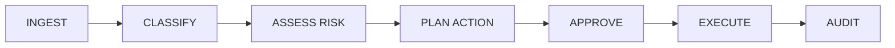

# Architecture

Fedrun Mail Agent is a compact single-process TypeScript agent. It is designed to run locally, avoid background daemons, and keep all risky external actions behind an explicit policy layer.

## Pipeline

## Modules

- `src/agent.ts` orchestrates the pipeline and records structured stage results.
- `src/agents/classificationAgent.ts` calls the shared local LLM client or local fallback.
- `src/agents/priorityAgent.ts` decides whether the operator should be notified.
- `src/agents/responseAgent.ts` normalizes suggested replies.
- `src/policy/engine.ts` is independent of the model and decides what is allowed.
- `src/gmail/client.ts` handles Gmail read and reply operations.
- `src/telegram/notifier.ts` sends notifications and approval buttons.
- `src/storage/*` stores local memory and approval state as small JSON files.

## LLM Boundary

The LLM is optional. The project never downloads a model. When configured, it can propose classification fields and reply text. It cannot authorize sending, clear a block, remove human approval, or override prompt-injection signals.

## Execution Model

By default, `MAIL_AGENT_DRY_RUN=true`. In dry-run mode, the agent plans actions and records them but does not send email replies. Real sending requires dry-run to be disabled and a configured provider.
